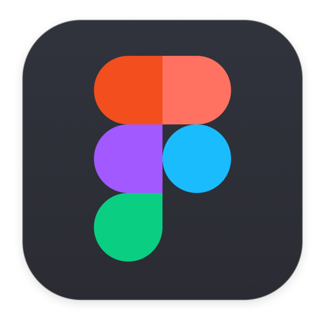

  
  

## Hello, I am Akshay Hallagade 

 

 

## Stats

  

 

### Hey, My Current Ongoings. 👋

- 🔭 I’m currently working on Technical Knowledge + Learning Tools + Developement @scaler
- 🌱 I’m currently learning ...Web dev (Scaler), React, DSA and HLD And LLD.
- 👯 I’m looking to collaborate on ...Any one from Web development, HTML, CSS, JavaScript, React, Next.js, Tailwind.
- 💬 Ask me about ...Anything
- 📫 How to reach me: ...Contacts Given above. (Click on the logo)
- 😄 Pronouns: ...Ash (Aksh with K-silent)
- ⚡ Fun fact: .... Obsessed with woorrrkkkaaa....

 

### Skills 

  <code></code>
  <code></code>
  <code></code>
  <code></code>
  <code></code>
  <code></code>
  <code></code>
  <code></code>
  <code></code>
  <code></code>
  <code></code>
  <code></code>
  <code></code>
  <code></code>
  <code></code>
  <code></code>
  <code></code>
  <code></code>
  <code></code>
  <code></code>
  <code></code>

## Cards

|  |  |
| ------------------------------------------------------------------------------------------------------------------------------------------------------------------------------------------------------------------------ | ----------------------------------------------------------------------------------------------------------------------------------------------------------------------------------------------------------------------------- |

|  |  |
| ---------------------------------------------------------------------------------------------------------------------------------------------------------------------------------------------------------------- | ----------------------------------------------------------------------------------------------------------------------------------------------------------------------------------------------------------- |

|  |  |
| --------------------------------------------------------------------------------------------------------------------------------------------------------------------------------------------------------------- | ---------------------------------------------------------------------------------------------------------------------------------------------------------------------------------------------------------------------- |
